# SahakarSeva

**Cooperative Gig Services Platform for Household and Community Services**
Smart India Hackathon 2026 · Problem Statement SIH26089 · Ministry of Cooperation (NCCT)

A cooperative-owned marketplace where households book verified workers from Labour Cooperative Societies. Workers keep 80% of every rupee, jobs are shared fairly across the society, welfare cover is visible to the customer, and the federation gets a seven-day AI demand forecast instead of surge pricing.

<p align="center">
  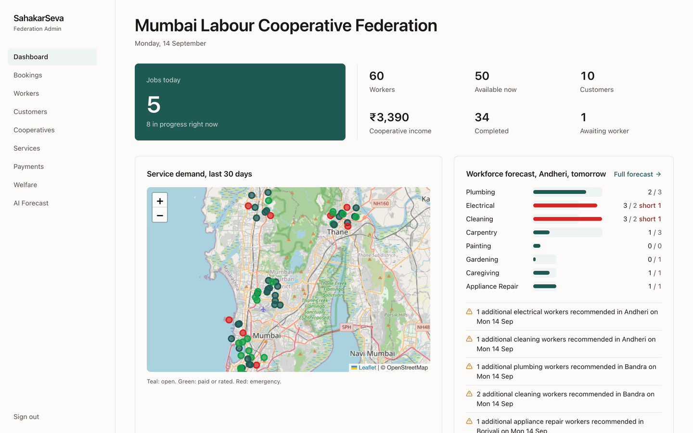
</p>

## The problem

India's household-services gig economy is run by private platforms that take 25 to 40% commission, route work to whoever is closest regardless of how many jobs they already have, and offer workers no insurance, no accident cover, and no bargaining power. Labour Cooperative Societies exist in every district and already do verification, training, and welfare, but they have no digital channel to the customer.

## What SahakarSeva does

| Private gig platform | SahakarSeva |
|---|---|
| 25 to 40% commission, opaque | **80 / 20 split** shown to the customer and the worker on every booking |
| Nearest worker wins | **Fair-workload matching**: skill, distance, availability, rating, experience, and jobs-this-week all score the match |
| No welfare | **Insurance, accident cover, and cooperative membership** shown as badges on every worker |
| Surge pricing when demand spikes | **XGBoost demand forecast** tells the federation where workers will be short next week |
| One language, one app | **Hindi, Marathi, English**, one app for customers and workers |
| Unverified freelancers | Society-verified certifications, verified by the federation admin |

## Screenshots

### Customer app

| Sign in | Book a service | Matched workers | Booking timeline |
|---|---|---|---|
| 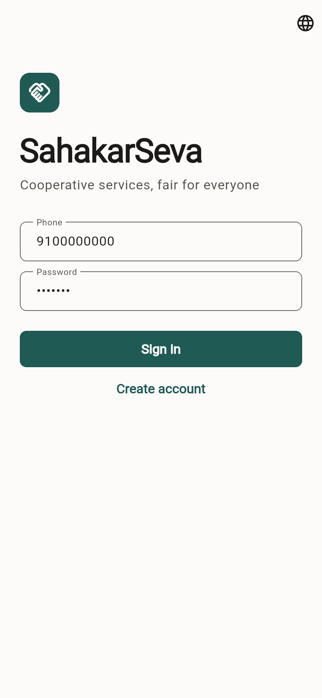 | 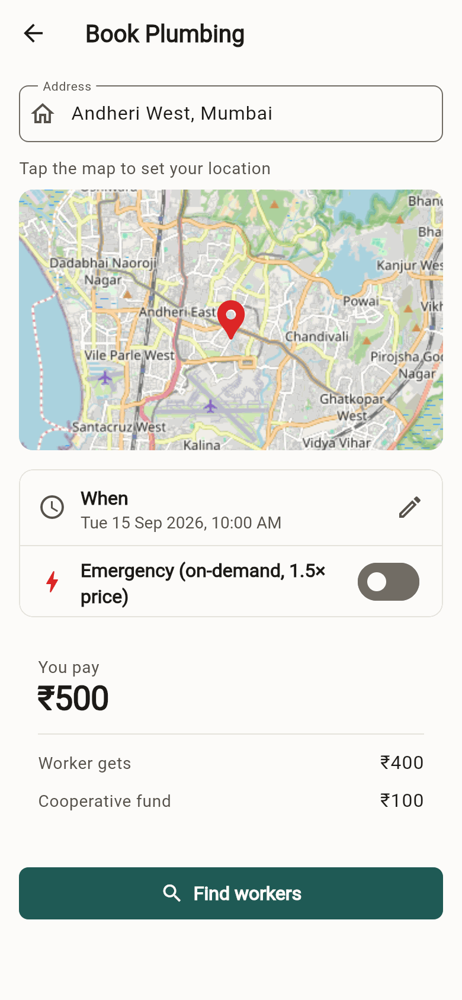 | 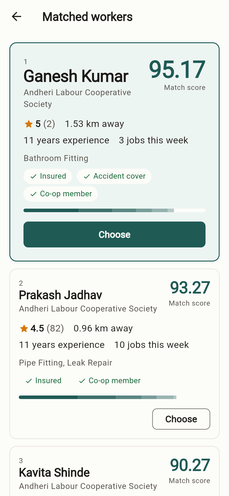 | 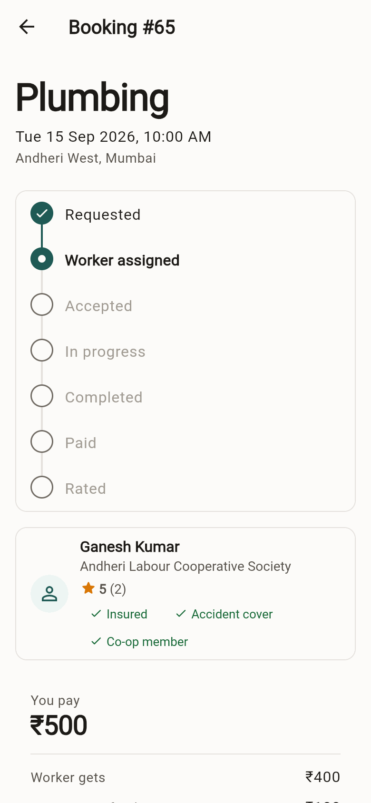 |

The match screen is the heart of the pitch: Ganesh (3 jobs this week, 1.5 km away) ranks above Prakash (10 jobs this week, 0.96 km away). The score bar shows exactly why.

### Worker app

| New requests | Earnings | Profile and welfare | Dark mode |
|---|---|---|---|
| 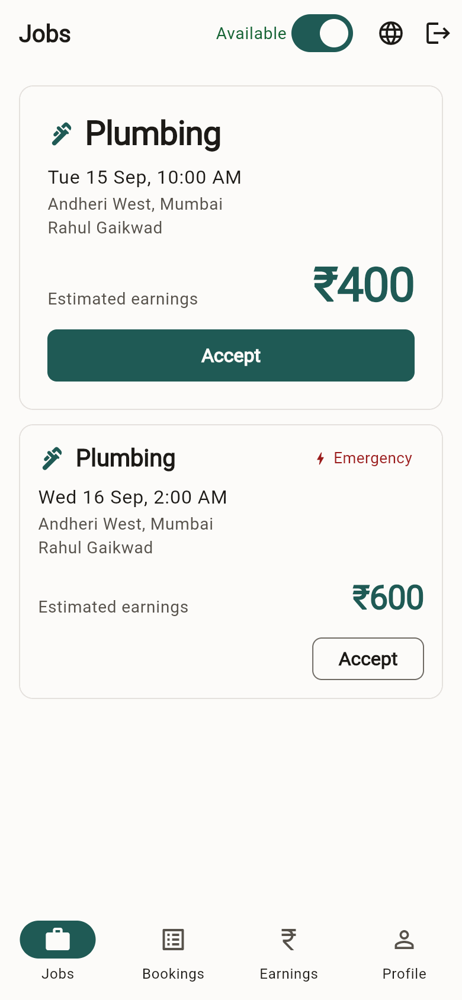 | 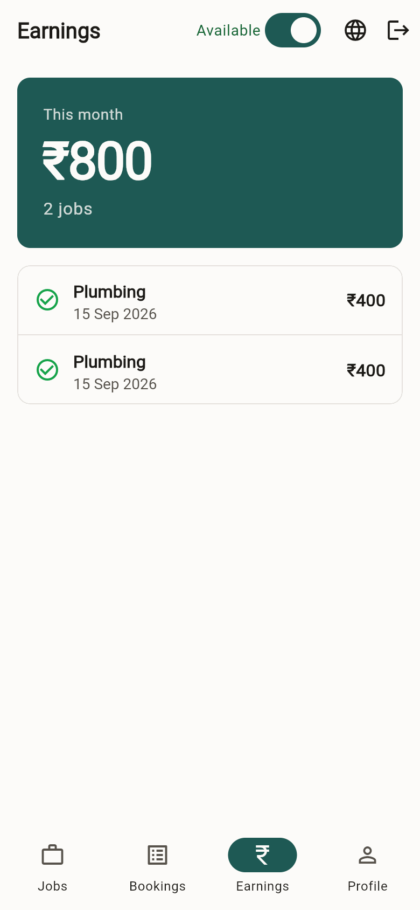 | 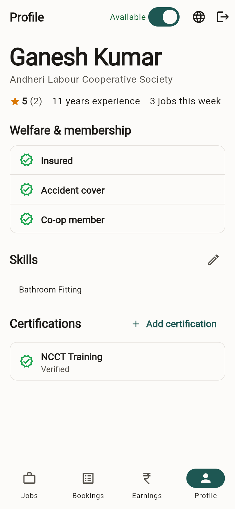 | 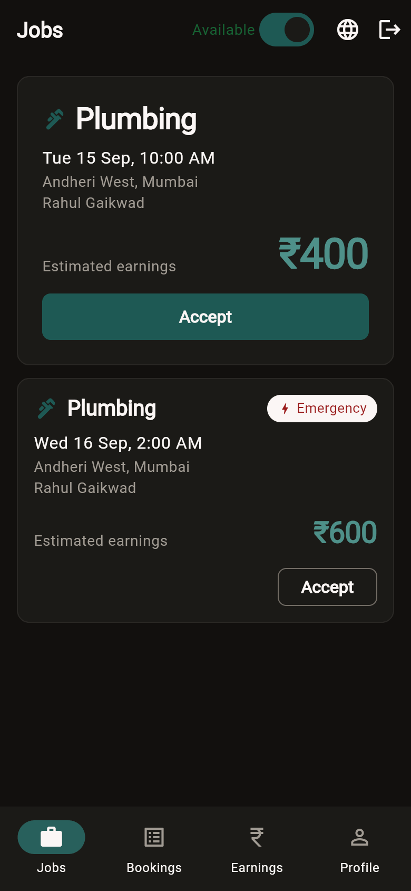 |

Workers see their estimated earnings before accepting, and every rupee paid to them this month.

### Federation admin

| AI demand forecast | Bookings |
|---|---|
| 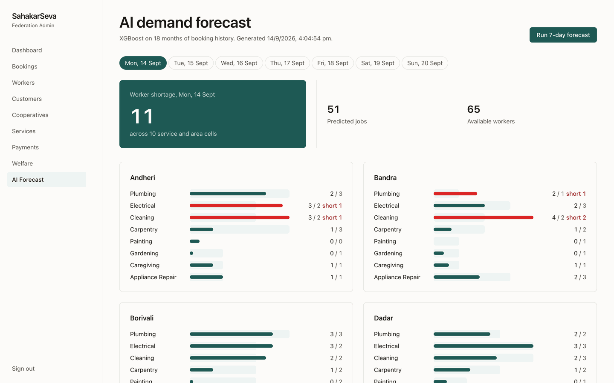 | 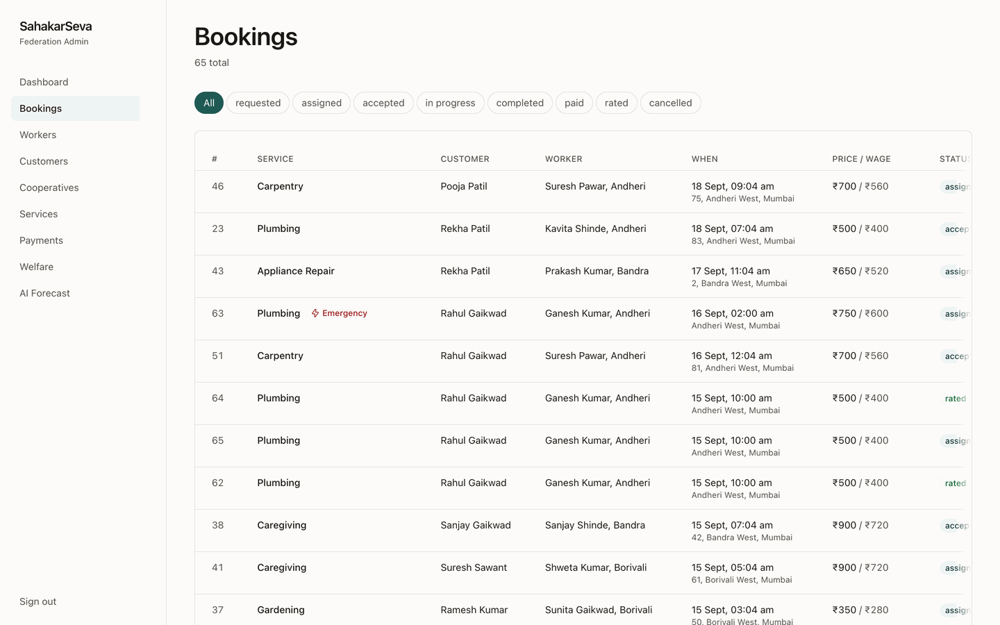 |

| Workers and certifications | Payments and settlement |
|---|---|
| 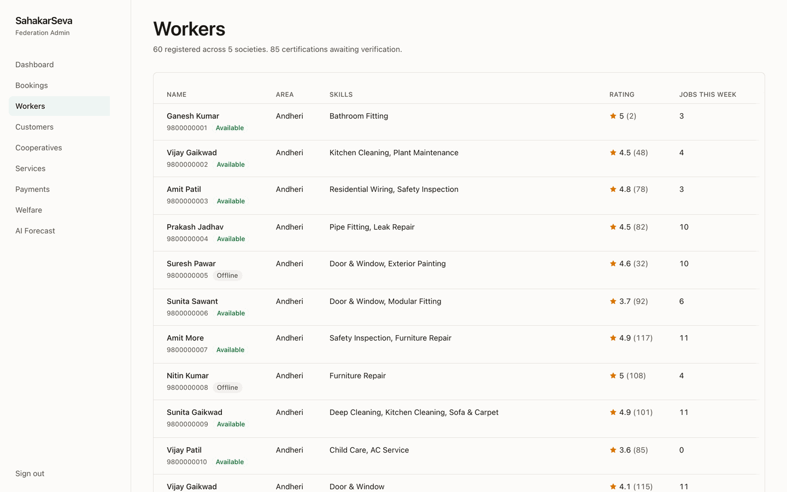 | 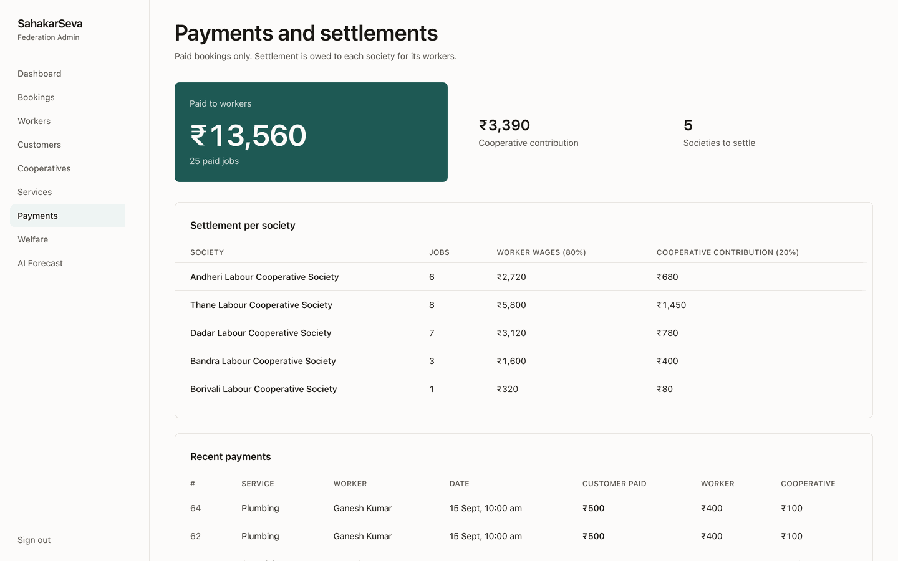 |

| Worker welfare | Dashboard, dark | Dashboard, phone |
|---|---|---|
| 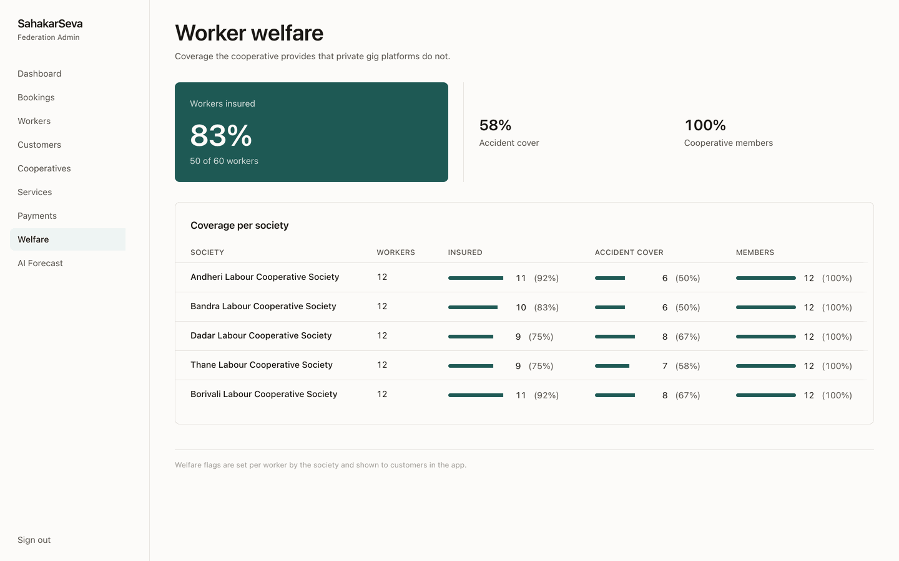 | 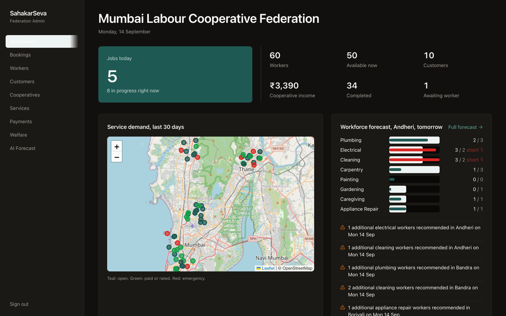 | 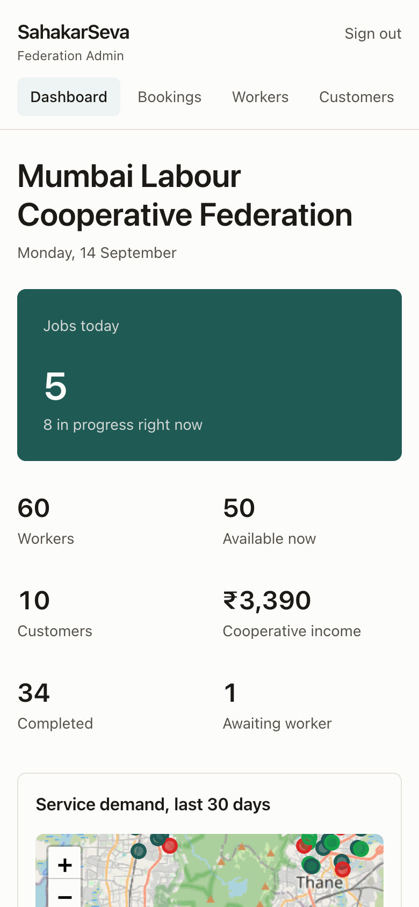 |

## How it works

```
Customer app ─┐                      ┌─ PostgreSQL + PostGIS (workers, bookings, geography)
Worker app   ─┼─► FastAPI (REST) ────┼─ XGBoost forecast (demand_history → forecasts)
Admin (web)  ─┘                      └─ Razorpay (test mode)
```

**Booking lifecycle.** `requested → assigned → accepted → in_progress → completed → paid → rated`, with `cancelled` allowed until the worker starts. Every transition goes through one function on the backend; the apps only display what the API returns.

**Pricing.** `price = base_price × 1.5 if emergency`. `worker_wage = price × 80%`, `coop_contribution = price × 20%`. Decimal arithmetic end to end; an invoice is generated the moment a job is completed.

**Matching.** Candidates are available workers with the required skill within 10 km (PostGIS `ST_DWithin`) and no booking within ±2 hours. Each is scored out of 100:

| Factor | Weight | Signal |
|---|---|---|
| Skill | 35 | has the exact skill for the service |
| Distance | 25 | linear falloff to 10 km |
| Availability | 15 | free at the requested time |
| Rating | 10 | running average of customer ratings |
| Experience | 10 | years, capped at 10 |
| Fair workload | 5 | fewer jobs this week ranks higher |

Emergency bookings skip the choice and auto-assign the top candidate.

**Forecasting.** An XGBoost regressor (200 trees, depth 4) trained on 18 months of daily bookings per service and area, with features `service, area, day-of-week, month, is_weekend, lag-7, lag-14`. It predicts seven days ahead recursively. `shortage = max(round(predicted) − available workers, 0)`; every shortage becomes a recommendation for the federation.

## Tech stack

| Layer | Choice | Why |
|---|---|---|
| Backend | Python 3.12, FastAPI, SQLAlchemy 2, Alembic, pydantic-settings | Fast to build, typed, auto-documented (`/docs`) |
| Database | PostgreSQL 16 + PostGIS 3.4 (Docker) | Geography queries for matching and the demand map |
| ML | XGBoost, pandas | Tabular time-series with lags; trains in seconds on the seed data |
| Auth | JWT (HS256), bcrypt; access 15 min, refresh 30 days | Three roles: customer, worker, admin |
| Payments | Razorpay SDK (test mode) with a demo-mark-paid path | Real order creation and signature verification are wired; the demo skips the checkout UI |
| Admin | Next.js 16 (App Router, server components), Tailwind v4, react-leaflet | One codebase, zero client state, OpenStreetMap tiles |
| Mobile | Flutter 3.47, flutter_map, intl, flutter_localizations | One app, role chosen at sign-in, EN/HI/MR via ARB files |
| Design system | DTCG tokens → generated CSS variables (admin) and Dart constants (app) | One theme for both clients, light and dark, WCAG 2.2 AA verified on the source |
| Tests | pytest (22 tests on the real PostGIS DB), `flutter analyze`, `next build` | Pricing, matching, lifecycle, forecast, and the auth boundary are covered |

## Repository

```
backend/    FastAPI + SQLAlchemy + PostGIS + XGBoost      backend/README.md
admin/      Next.js federation dashboard                  admin/README.md
mobile/     Flutter customer + worker app (EN/HI/MR)      mobile/README.md
tokens/     design tokens (source of truth for both UIs)
docs/       architecture, API, development, deployment, demo script, screenshots
```

| Doc | What it covers |
|---|---|
| [docs/ARCHITECTURE.md](docs/ARCHITECTURE.md) | System design, data model, pricing, matching, state machine, forecasting, auth |
| [docs/API.md](docs/API.md) | Every endpoint with shapes and a curl walkthrough |
| [docs/DEVELOPMENT.md](docs/DEVELOPMENT.md) | Setup, running, testing, common tasks, troubleshooting |
| [docs/DEPLOYMENT.md](docs/DEPLOYMENT.md) | Railway/Vercel, env vars, APK, Razorpay |
| [docs/DEMO-SCRIPT.md](docs/DEMO-SCRIPT.md) | 5-minute judge demo with seed accounts |
| [docs/SIH-PPT-CONTEXT.md](docs/SIH-PPT-CONTEXT.md) | Presentation brief |
| [docs/superpowers/specs](docs/superpowers/specs/2026-09-14-coop-gig-platform-design.md) | Approved design spec (source of truth) |
| [CLAUDE.md](CLAUDE.md) / [AGENTS.md](AGENTS.md) | Agent guidance: rules, repo map, gotchas, where to change what |

## Quick start

```bash
docker compose up -d db
cd backend && uv sync && uv run alembic upgrade head && uv run python seed.py && uv run uvicorn app.main:app --port 8000
```
```bash
cd admin && npm install && npm run dev            # http://localhost:3000
```
```bash
cd mobile && flutter pub get && flutter run -d chrome
```

Seed accounts (password `pass123`): admin `9999999999`, customer `9100000000`, worker `9800000001` (Ganesh Kumar, Andheri LCS). macOS needs `brew install libomp` for XGBoost. Full walkthrough in [docs/DEMO-SCRIPT.md](docs/DEMO-SCRIPT.md).

## Seed data

Mumbai Labour Cooperative Federation with 5 member societies (Andheri, Bandra, Borivali, Dadar, Thane), 60 workers across 8 services, 10 customers, ~60 bookings in every lifecycle state, and 18 months of daily demand history calibrated so the forecast shows a shortage in roughly a third of service-area cells.

## Status

Working prototype for the SIH 2026 idea submission. Deliberately out of scope: real settlement and KYC, push notifications, file uploads for certificates, refresh-token rotation in the admin, pagination.
